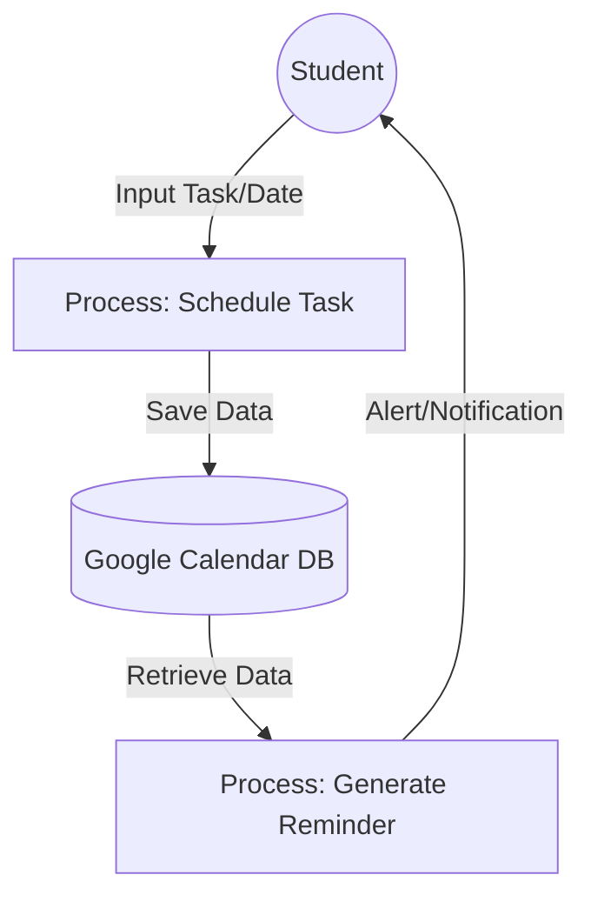

# self-organized-schedule
The idea of the project is Self-Organized Schedule for students. 

--- 

**Problem Statment :** Many students struggle to organize their daily tasks and study schedules correctly. 
Through our own interviews with students from different cities and countries, we discovered a common pattern: a lack of clear structure leads to a total loss of free time. This constant pressure makes students feel exhausted and burned out.

---
**Current Solutions :** Google Calendar, Notion, Pomodoro Technique, etc. 

Many students face academic burnout because popular tools like Google Calendar and Notion require too much manual organization. These passive solutions often create an extra management burden, forcing students to spend more time planning their work than actually doing it. That's why current solutions don't work as they should.

---

**DFD For Current Solutions**

*№1 Google Calendar*


*№2 Notion*
```mermaid
graph TD
    User((Student)) -- "Input Content/Blocks" --> P1[Process: Content Structuring]
    P1 -- "Metadata & Content" --> DB[(Notion Workspace DB)]
    DB -- "Retrieve Page Data" --> P2[Process: UI Rendering]
    P2 -- "Visual Dashboard" --> User
